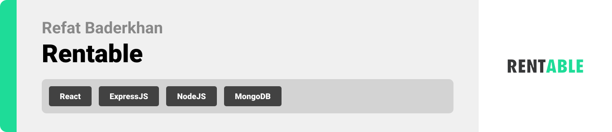

<br><br>

<!-- project philosophy -->
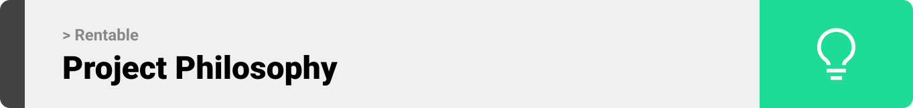

> A platform that connects owners and renters of basically everything that can be borrowed temporarily instead of purchasing. The goal is to save the environment, money, and space.
>

### User Stories
-As a Borrower, I want to go on rentable, so I can sit at home comfortably and search for items I can borrow temporarily without the need to buy them.<br>
-As a Lender, I want to list my items for rent on Rentable, so I will make money out of them.<br>
-As a Borrower, after finding a listing I’m interested in, I want to know more about it, so I will text the Lender through the built-in direct messages feature.<br>
-As a Borrower, I don’t want to take risks, so I will check the Lender’s rating.<br>
-As a Lender, I don’t want to take risks, so I will check the borrower’s rating.<br>


<br><br>

<!-- Prototyping -->
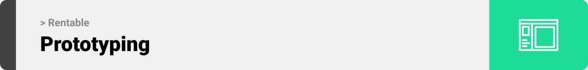

> I designed Rentable using wireframes and mockups, iterating on the design until we reached the ideal layout for easy navigation and a seamless user experience.

### Wireframes
| Landing screen  | Profile screen |  Item screen |
| ---| ---| ---|
| 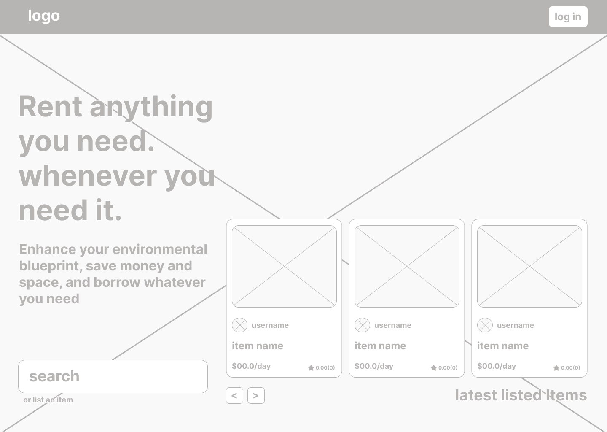 | 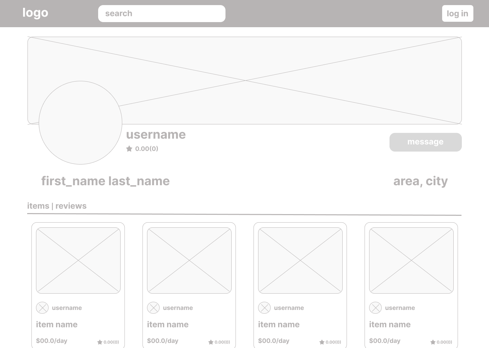 | 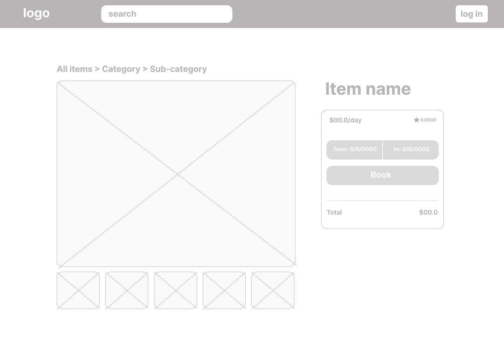 |

### Mockups
| Landing screen  | Profile Screen | Item Screen |
| ---| ---| ---|
| 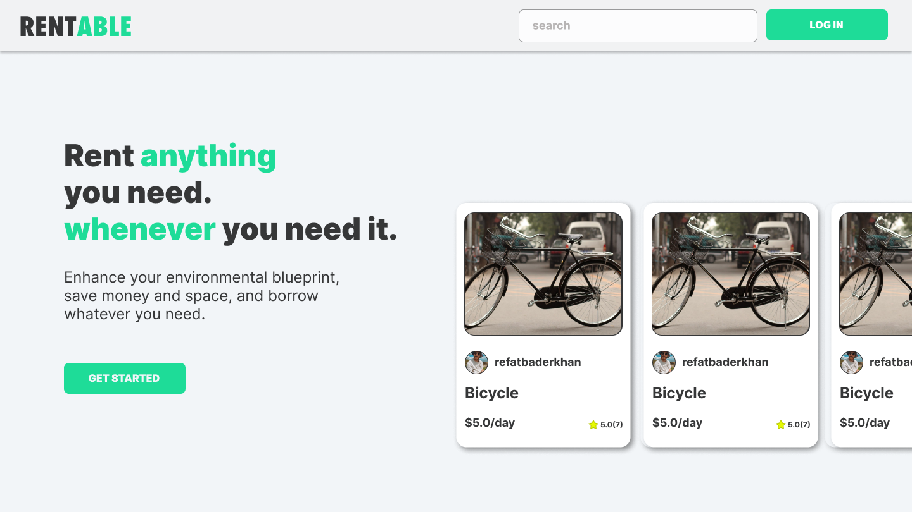 | 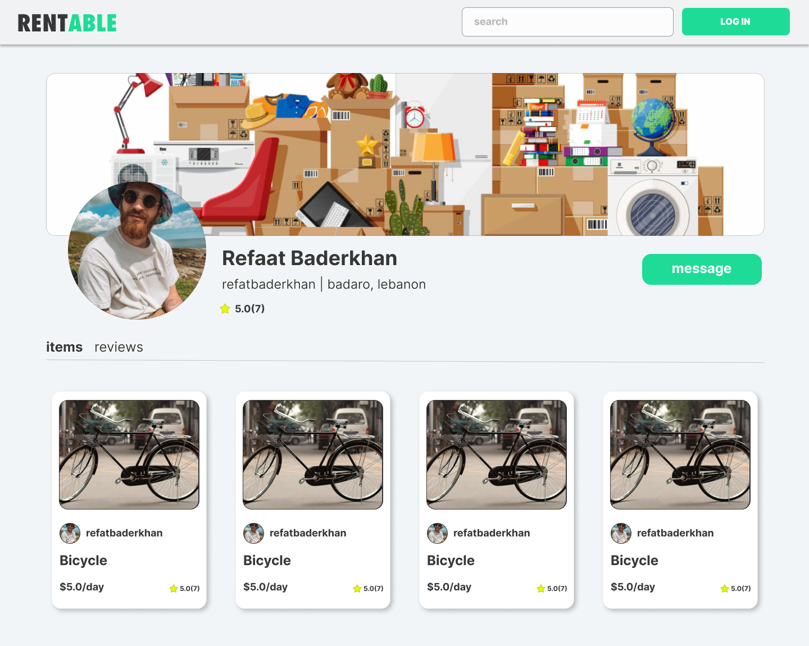 | 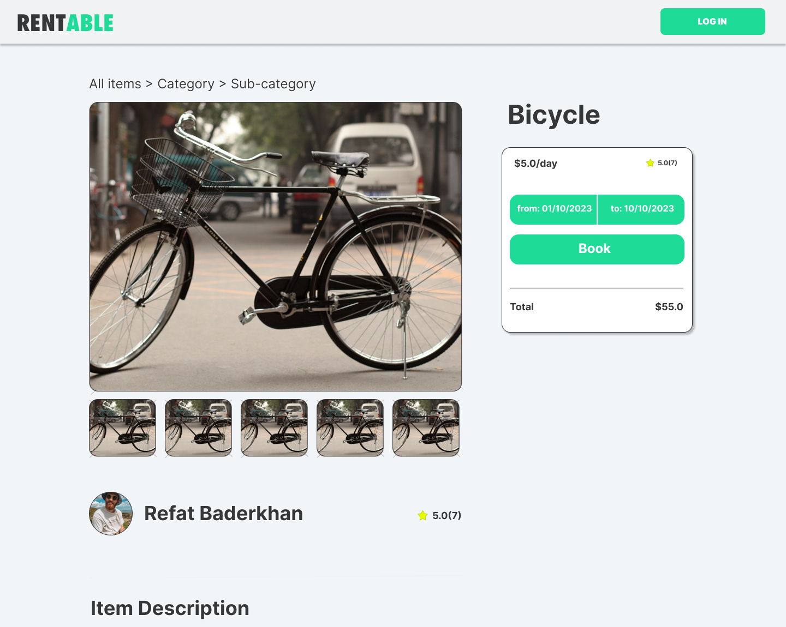 |

<br><br>

<!-- Implementation -->


> Using the wireframes and mockups as a guide, I implemented the Rentable website with the following features:

### User Screens (Web)
| Landing screen  | Search screen |  Profile screen |
| ---| ---| ---|
| 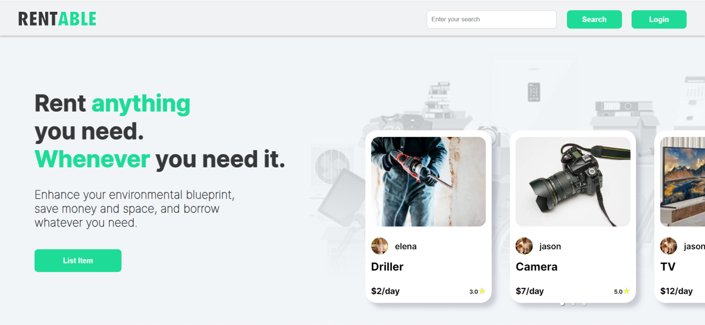 |  | 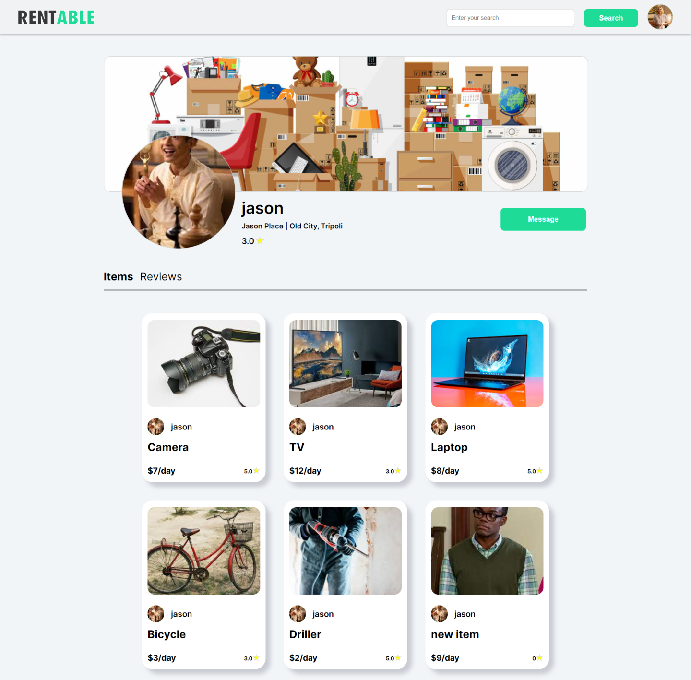 |
| Register screen  | Chat Screen | Login Screen |
| 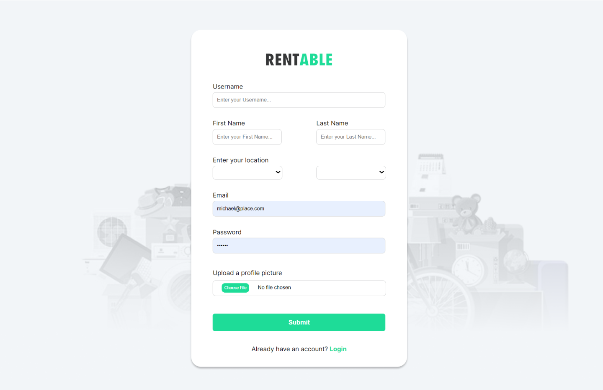 | 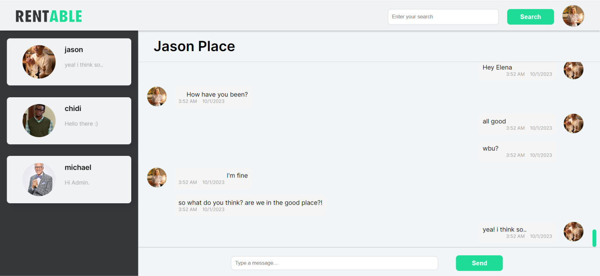 | 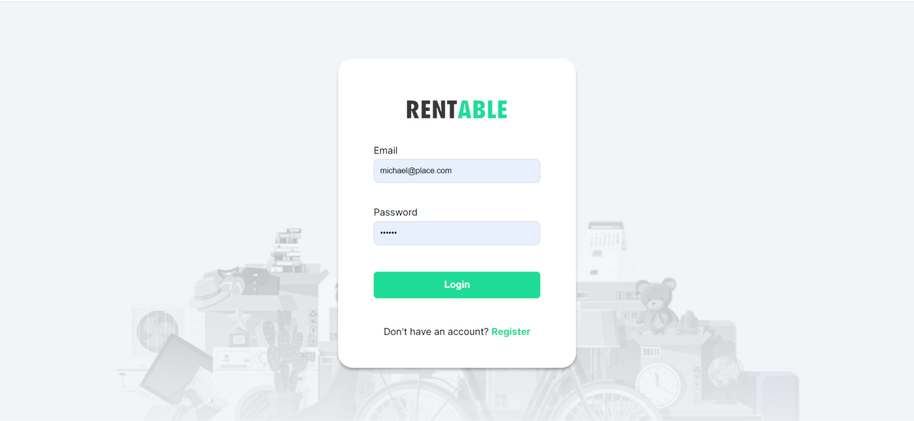 |

### Admin Screens (Web)
| Admin dashboard screen  |
| ---|
| 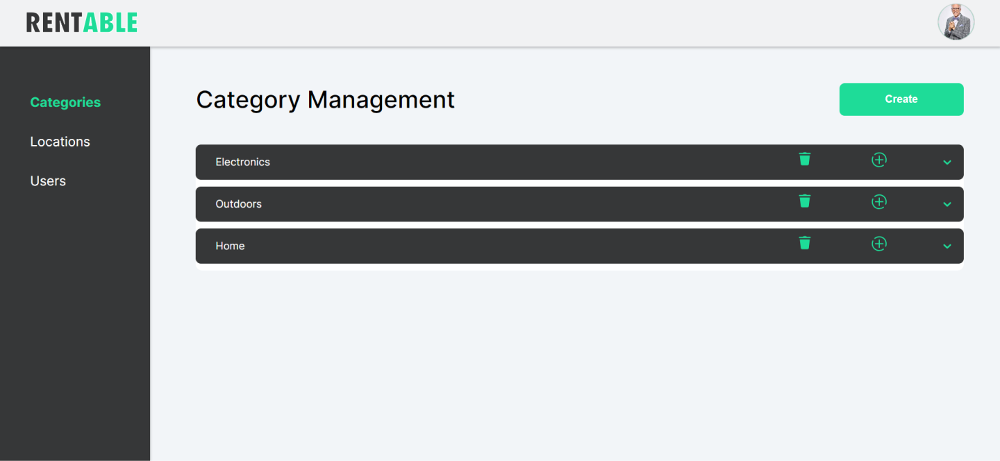 |

<br><br>

<!-- Demo -->
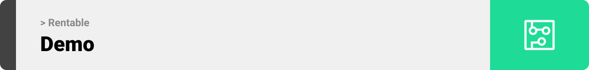

<div align="center">

| Landing screen  |
| ---|
| 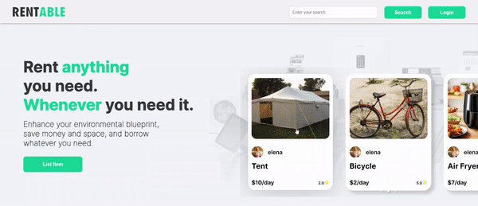 |

| Admin login screen  |
| ---|
| 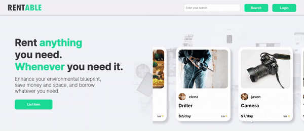 |

| Admin dashboard screen  |
| ---|
| 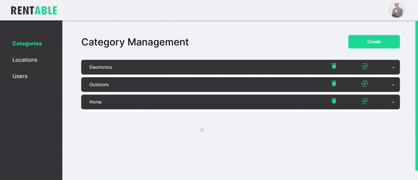 |

| User login screen  |
| ---|
| 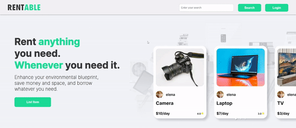 |

| Add item screen  |
| ---|
| 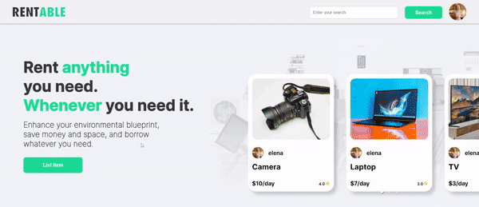 |

| Item screen  |
| ---|
|  |

| Profile screen  |
| ---|
| 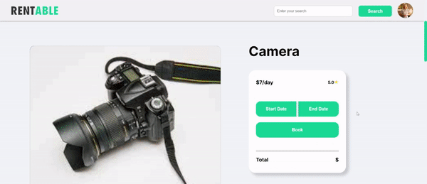 |

| Live chat screen  |
| ---|
| 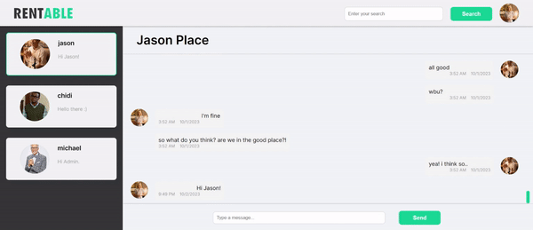 |
</div>

<br><br>

<!-- Tech stack -->
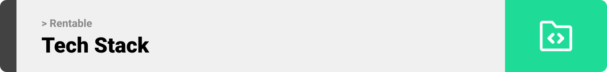

###  Rentable is built using the following technologies:

- [React](https://reactjs.org/): Rentable's front-end is built using ReactJS, a popular JavaScript library for building user interfaces. This choice ensures a highly responsive and interactive interface that caters to a modern web audience.
- [Redux](https://redux.js.org/): To manage the application's state efficiently, Redux is integrated into Rentable, enabling real-time updates and a smooth flow of data throughout the application.
- [Node.js](https://nodejs.org/): The server-side runtime environment of Rentable is Node.js, which enables asynchronous operations and provides a fast and scalable foundation for the application's core functionality.
- [Express](https://expressjs.com/): Rentable's back-end is powered by Express, a minimalist Node.js web application framework. Express simplifies the creation of RESTful APIs and handles server-side logic, ensuring secure and efficient data transmission.
- [MongoDB](https://www.mongodb.com/): For data storage, Rentable relies on MongoDB, a NoSQL database known for its scalability and flexibility. MongoDB allows for efficient data retrieval and storage of property listings, user profiles, and more.
- [Socket.io](https://socket.io/): Real-time communication and updates are facilitated through Socket.io, a library for enabling bidirectional, event-based communication between the server and clients. This was used to implement the live chat feature in the website.


<br><br>

<!-- Server -->
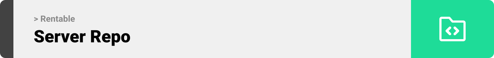

> server repo: https://github.com/refatbaderkhan/rentable-server

<br><br>

<!-- Performance -->
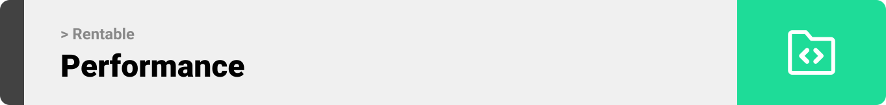

> The following tests were done using  Postman to assess the functionality of my application's primary APIs

<br>
URL: http://34.241.32.106:80/items

```sh 
PASS: Response time is within acceptable range //161 ms
PASS: Response content type is JSON
PASS: Response schema is valid
```
<br>
URL: http://34.241.32.106:80/account

```sh 
PASS: Response time is within acceptable range //170 ms
PASS: Response content type is JSON
PASS: Response schema is valid
```
<br>
URL: http://34.241.32.106:80/cities

```sh 
PASS: Response time is within acceptable range //161 ms
PASS: Response content type is JSON
PASS: Response schema is valid
```

<br><br>


<!-- How to run -->


> To set up Rentable locally, follow these steps:

### Prerequisites

Make sure to download the latest npm version on your machine.
* npm
  ```sh
  npm install npm@latest -g
  ```

### Installation

1. Clone the server repo
   ```sh
   git clone https://github.com/refatbaderkhan/rentable-server
   ```
2. Install NPM packages
   ```sh
   npm install
   ```
3. Run the server
   ```sh
   "/server-directory>" npm run dev
   ```
4. Clone the client repo
   ```sh
   git clone https://github.com/refatbaderkhan/rentable-server
   ```
5. Install NPM packages
   ```sh
   npm install
   ```
6. Run the the application
   ```sh
   "/client-directory>" npm start
   ```

Now, you should be able to run Rentable localy and access it's features using your web browser.
