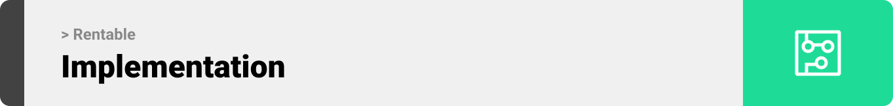
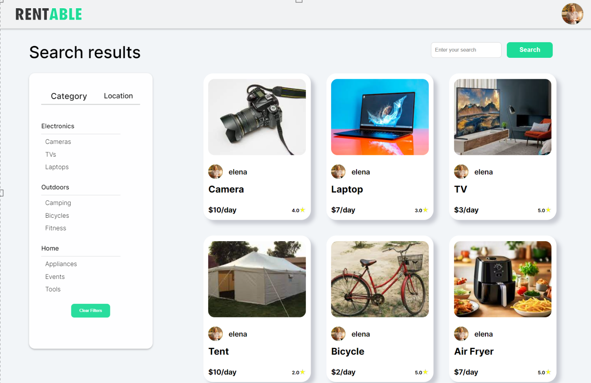

server repo: https://github.com/refatbaderkhan/rentable-server


<br><br>

<!-- project philosophy -->


> A platform that connects owners and renters of basically everything that can be borrowed temporarily instead of purchasing. The goal is to save the environment, money, and space.
>

### User Stories
-As a Borrower, I want to go on rentable, so I can sit at home comfortably and search for items I can borrow temporarily without the need to buy them.<br>
-As a Lender, I want to list my items for rent on Rentable, so I will make money out of them.<br>
-As a Borrower, after finding a listing I’m interested in, I want to know more about it, so I will text the Lender through the built-in direct messages feature.<br>
-As a Borrower, I don’t want to take risks, so I will check the Lender’s rating.<br>
-As a Lender, I don’t want to take risks, so I will check the Borrowers’s rating.<br>


<br><br>

<!-- Prototyping -->


> I designed Rentable using wireframes and mockups, iterating on the design until we reached the ideal layout for easy navigation and a seamless user experience.

### Wireframes
| Landing screen  | Profile screen |  Item screen |
| ---| ---| ---|
|  |  |  |

### Mockups
| Landing screen  | Profile Screen | Item Screen |
| ---| ---| ---|
|  |  |  |

<br><br>

<!-- Implementation -->


> Using the wireframes and mockups as a guide, I implemented the Rentable website with the following features:

### User Screens (Web)
| Landing screen  | Search screen |  Profile screen |
| ---| ---| ---|
|  |  |  |
| Register screen  | Chat Screen | Login Screen |
|  |  |  |

### Admin Screens (Web)
| Admin dashboard screen  |
| ---|
|  |
<br><br>

<!-- Tech stack -->


###  Rentable is built using the following technologies:

- Socket.io: Real-time communication and updates are facilitated through Socket.io, a library for enabling bidirectional, event-basedcommunication between the server and clients. This was used to implement the live chat feature in the website.

> To set up Rentable locally, follow these steps:

### Prerequisites

Make sure to download the latest npm version on your machine.
* npm
  ```sh
  npm install npm@latest -g
  ```

### Installation

1. Clone the server repo
   ```sh
   git clone https://github.com/refatbaderkhan/rentable-server
   ```
2. Install NPM packages
   ```sh
   npm install
   ```
3. Run the server
   ```sh
   "/server-directory>" npm run dev
   ```
4. Clone the client repo
   ```sh
   git clone https://github.com/refatbaderkhan/rentable-client
   ```
5. Install NPM packages
   ```sh
   npm install
   ```
6. Run the the application
   ```sh
   "/client-directory>" npm start
   ```

Now, you should be able to run Rentable localy and access it's features using your web browser.
